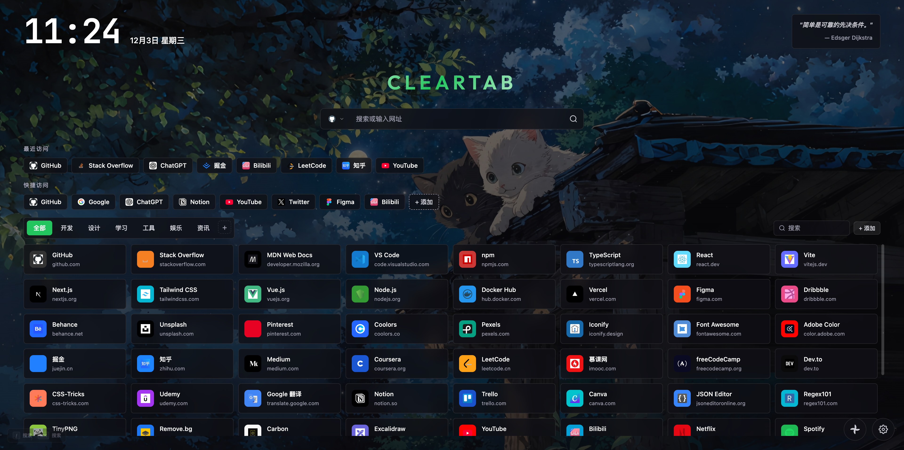
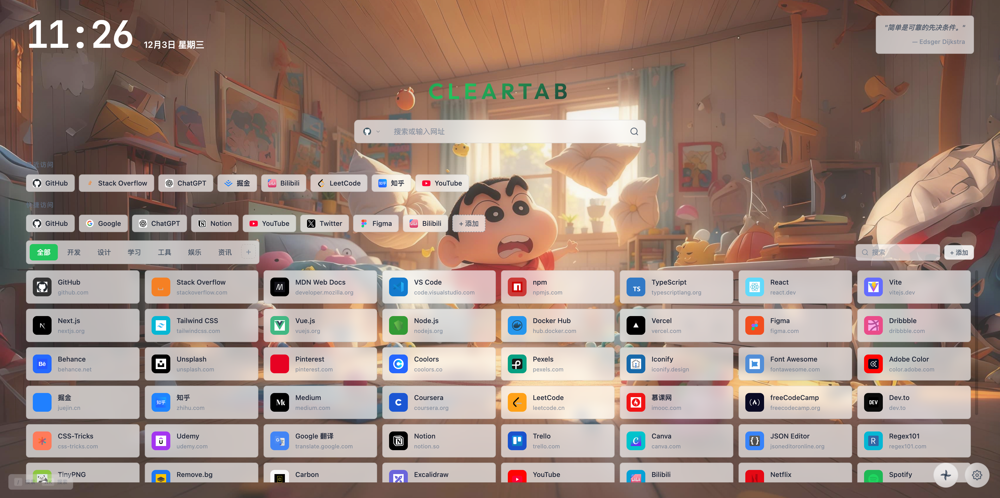

<div align="center">

# ClearTab

**🎨 简洁高效的浏览器新标签页扩展**

一个基于 React + TypeScript 构建的现代化浏览器新标签页，专注于简洁设计与高效体验。

[](https://opensource.org/licenses/MIT)
[](https://react.dev/)
[](https://www.typescriptlang.org/)
[](https://vitejs.dev/)
[](https://github.com/CooperJiang/ClearTab)

[English](#english) | [中文](#中文)

</div>

---

## 中文

### 预览

<p align="center">
  
</p>

<p align="center">
  
</p>

### ✨ 特性

- **🎯 极简设计** - 干净清爽的界面，专注于效率
- **🔍 多搜索引擎** - 支持 25+ 搜索引擎，一键切换，支持自定义引擎
- **🔖 书签管理** - 6 大分类管理，快速访问常用网站，拖拽排序
- **⚡ 快捷访问** - 自定义快捷链接面板，一键直达常用网站
- **📊 最近访问** - 智能展示最近浏览的网站
- **🌓 深色/浅色主题** - 支持明暗模式切换，独立壁纸配置
- **🎨 自定义主题色** - 18 种预设主题色可选，个性化定制
- **🖼️ 壁纸设置** - 支持自定义壁纸、在线随机壁纸、模糊效果
- **🌐 多语言支持** - 中文 / English
- **⌨️ 键盘快捷键** - 全键盘操作支持 (/ 聚焦搜索, ⌘/Ctrl+K 全局搜索)
- **🔒 数据本地存储** - 所有数据保存在本地，隐私安全，无云端服务

### 安装

#### 从源码构建

```bash
# 克隆项目
git clone https://github.com/CooperJiang/TabZero.git
cd ClearTab

# 安装依赖
npm install

# 开发模式
npm run dev

# 构建生产版本
npm run build
```

#### 加载到 Chrome

1. 打开 Chrome，访问 `chrome://extensions/`
2. 开启右上角的「开发者模式」
3. 点击「加载已解压的扩展程序」
4. 选择项目的 `dist` 目录

### 技术栈

| 技术 | 说明 |
|------|------|
| [React 19](https://react.dev/) | UI 框架 |
| [TypeScript](https://www.typescriptlang.org/) | 类型安全 |
| [Vite](https://vitejs.dev/) | 构建工具 |
| [Zustand](https://zustand-demo.pmnd.rs/) | 状态管理 |
| [CSS Modules](https://github.com/css-modules/css-modules) | 样式隔离 |


### 快捷键

| 快捷键 | 功能 |
|--------|------|
| `/` | 聚焦搜索框 |
| `⌘/Ctrl + K` | 打开全局搜索 |
| `Esc` | 关闭弹窗/面板 |

### 配置项

- **壁纸设置** - 自定义壁纸、遮罩透明度、模糊效果
- **主题设置** - 深色/浅色模式、主题色、圆角大小
- **组件显示** - 时钟、每日一言、快捷链接等开关
- **搜索引擎** - 启用/禁用、排序、自定义引擎


## English

### Preview

<p align="center">
  
</p>

<p align="center">
  
</p>

### ✨ Features

- **🎯 Minimal Design** - Clean and focused interface for efficiency
- **🔍 Multi Search Engine** - 25+ search engines, one-click switch, custom engines supported
- **🔖 Bookmark Management** - 6 categories, quick access to your favorite sites, drag & drop
- **⚡ Quick Links** - Customizable shortcuts panel for instant access
- **📊 Recent Visits** - Smart display of recently browsed websites
- **🌓 Dark/Light Theme** - Theme toggle with independent wallpaper for each mode
- **🎨 Custom Accent Colors** - 18 preset theme colors for personalization
- **🖼️ Wallpaper Settings** - Custom wallpapers, random online wallpapers, blur effects
- **🌐 Multi-language** - Chinese / English
- **⌨️ Keyboard Shortcuts** - Full keyboard navigation (/ focus search, ⌘/Ctrl+K global search)
- **🔒 Local Storage** - All data stored locally for privacy, no cloud service

### Installation

#### Build from Source

```bash
# Clone the repository
git clone https://github.com/CooperJiang/TabZero.git
cd ClearTab

# Install dependencies
npm install

# Development mode
npm run dev

# Build for production
npm run build
```

#### Load in Chrome

1. Open Chrome and navigate to `chrome://extensions/`
2. Enable "Developer mode" in the top right
3. Click "Load unpacked"
4. Select the `dist` directory

### Tech Stack

| Technology | Description |
|------------|-------------|
| [React 19](https://react.dev/) | UI Framework |
| [TypeScript](https://www.typescriptlang.org/) | Type Safety |
| [Vite](https://vitejs.dev/) | Build Tool |
| [Zustand](https://zustand-demo.pmnd.rs/) | State Management |
| [CSS Modules](https://github.com/css-modules/css-modules) | Scoped Styling |

### Shortcuts

| Shortcut | Action |
|----------|--------|
| `/` | Focus search bar |
| `⌘/Ctrl + K` | Open global search |
| `Esc` | Close modal/panel |

### Contributing

Contributions are welcome! Please feel free to submit a Pull Request.

1. Fork the Project
2. Create your Feature Branch (`git checkout -b feature/AmazingFeature`)
3. Commit your Changes (`git commit -m 'Add some AmazingFeature'`)
4. Push to the Branch (`git push origin feature/AmazingFeature`)
5. Open a Pull Request

### License

This project is licensed under the [MIT License](LICENSE).

---

<div align="center">

**Made with ❤️ by [CooperJiang](https://github.com/CooperJiang)**

</div>
